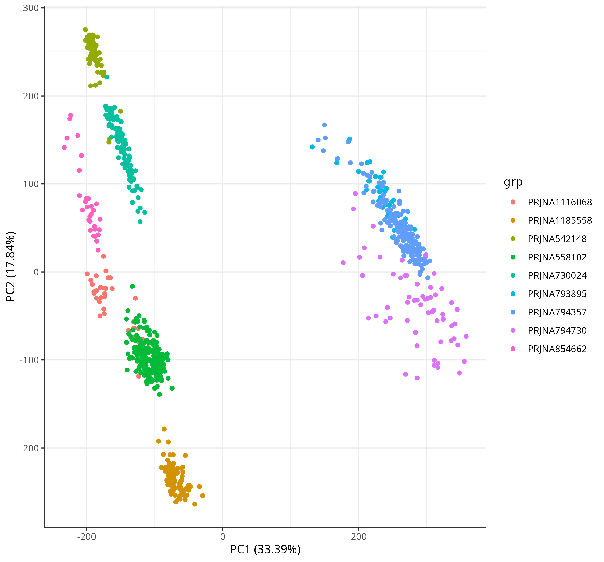
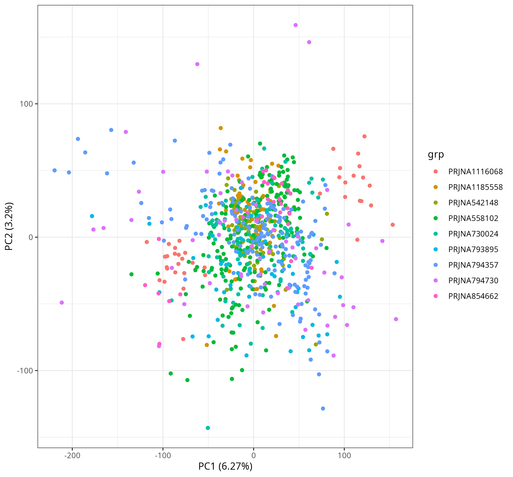
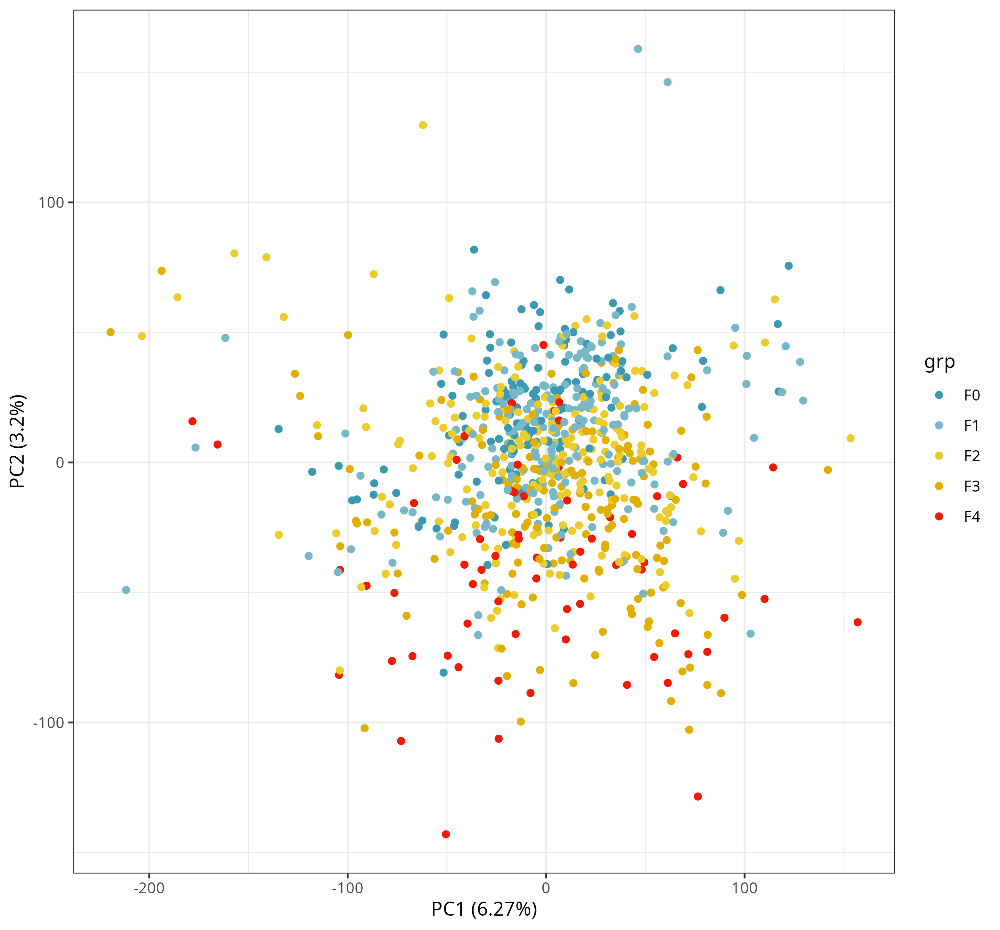
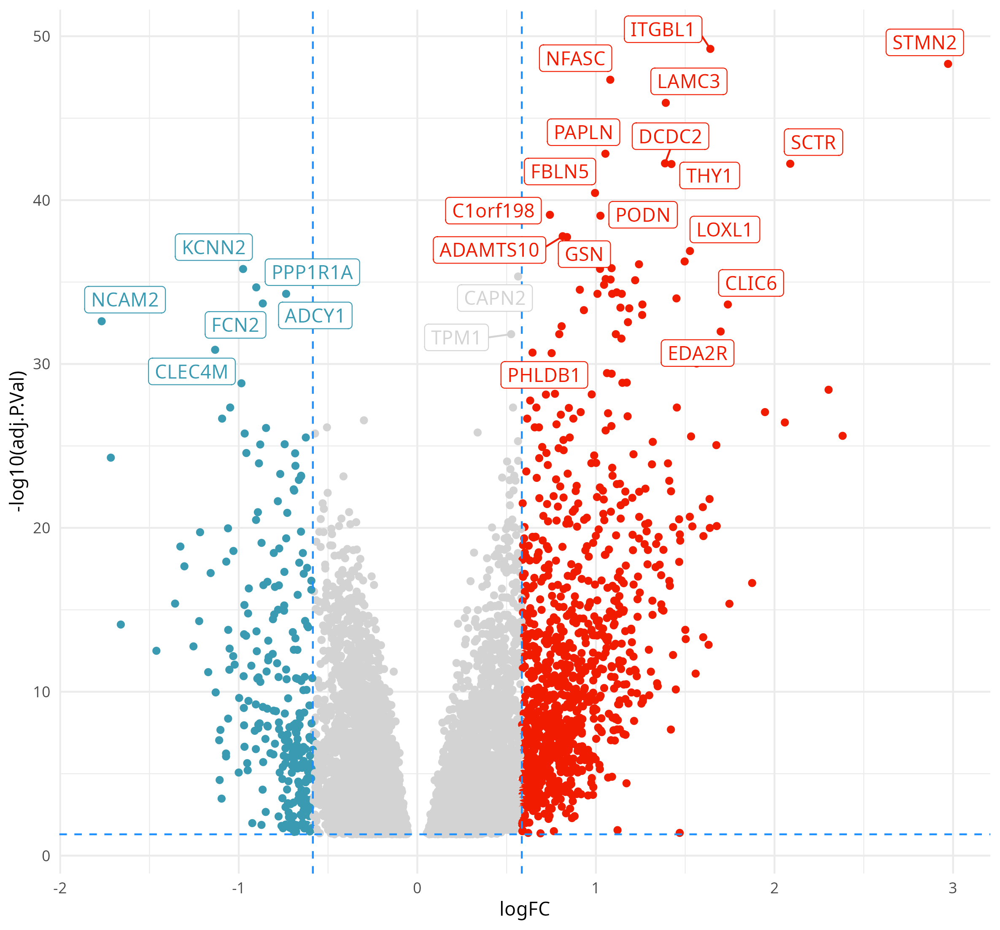

# meta-masld
Code for downloading and compiling a small metacohort from publicly available MASLD RNA-Seq data. 

## Overview
This repository accompanies the paper "The case for aggregation in MASLD transcriptomics", by Graham, Anstee & Cockell (2026). The paper makes the case and describes a strategy for the integration of publicly available RNA-Seq data from liver biosies of MASLD patients. 

The work in this repository represents a proof-of-principle for this strategy, providing harmonised counts and a simple batch-correction strategy for 832 biopsy samples sourced from nine NCBI BioProject accessions (representing seven Gene Expression Omnibus entries). 

## Inclusion Criteria
The criteria for inclusion was that a study must a) be available on GEO, and b) provide metadata that describes the histologicially-determined fibrosis stage of the biopsy sample. 

## Experimental Workflow
Prior to the exploratory data analysis code provided here, the data for these samples was downloaded from the Sequence Read Archive using sratools. Quantification estimates were then produced for the samples using Salmon (v1.10.2) and GenCode annontation (release 50). Annotation for these gene models was retrived from Ensembl using the biomaRt package (Ensembl release 116 - June '26) and is provided here in `metadata/gencode50_annotation.csv`. 

Transcript level counts were aggregated at the gene-level using tximport, and provided as a matrix for import here in `data/counts.csv.gz`. 

The script `scripts/meta_masld_basic_eda.R` describes an exploratory data analysis of these samples, describing a significant batch effect at the 'BioProject' level. The biological sex of each sample is also recorded, and should also be considered in any subsequent analysis.

## Included plots

### Uncorrected PCA plot

### PCA corrected for 'BioProject'

### PCA corrected for 'BioProject', coloured by fibrosis stage 

### Volcano plot of DEGs (mild vs advanced fibrosis)
 

